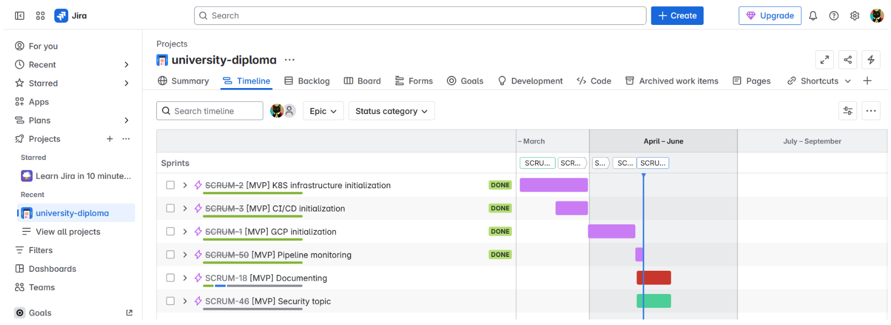
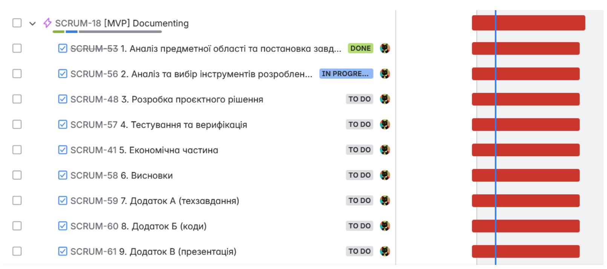
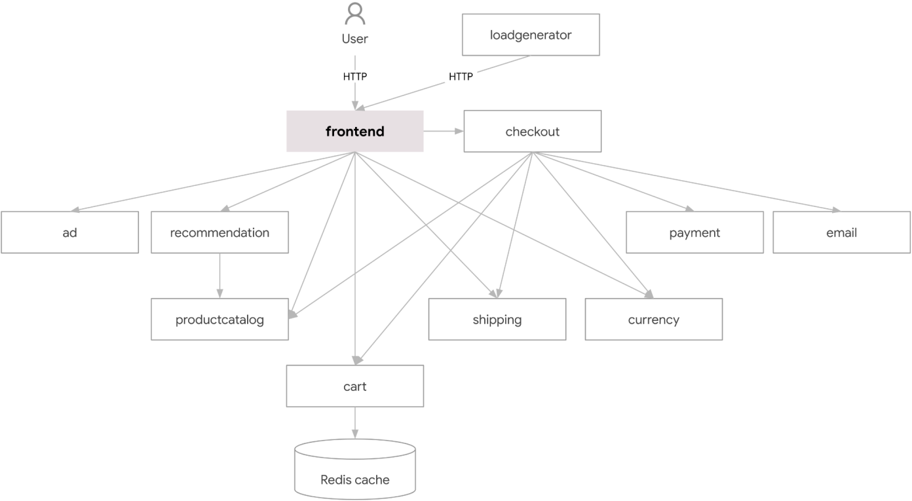
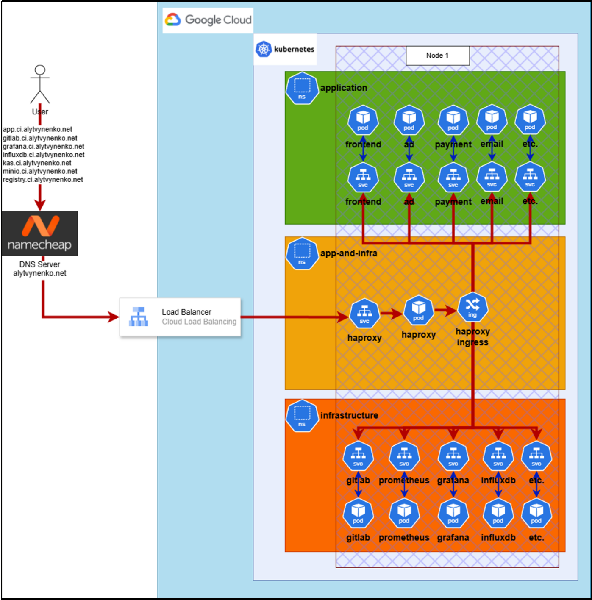
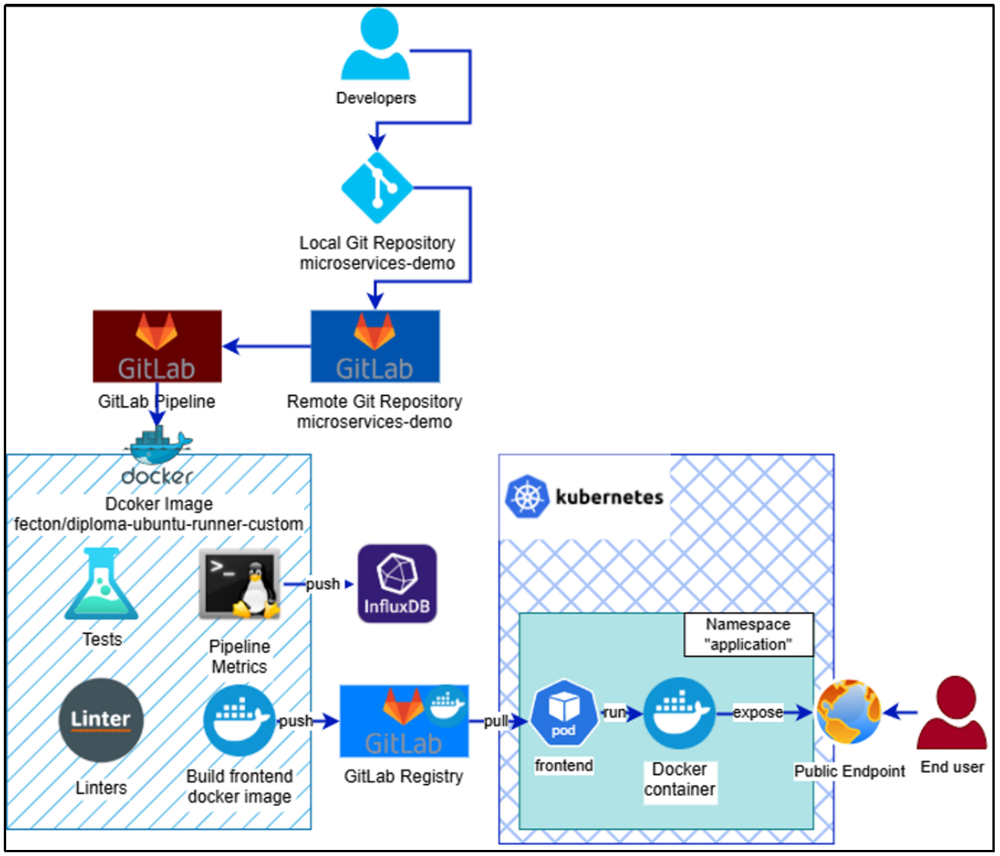

# 1. Analysis of Infrastructure Requirements

Based on the results of the previous section, in order to implement a project using DevOps practices to accelerate the software development process, the infrastructure must meet the following requirements:
* the infrastructure must provide monitoring of all components, including resource usage, and support an alerting system for changes or failures;
* the entire infrastructure must be created and configured using the Infrastructure as Code (IaC) approach to automate infrastructure management processes and minimize errors caused by human factors;
* the infrastructure must ensure the availability of all components, including the software application;
* the infrastructure must be secured using authentication mechanisms and encryption via the TLS protocol;
* the infrastructure must support automatic recovery of components in the event of a failure or application error;
* the infrastructure must allow for scaling according to changes in workload, both increasing and decreasing;
* the infrastructure must provide a centralized storage system for information that can be used for further analysis or visualization.

# 2. Key Infrastructure Components

The next step in meeting the specified requirements is to identify the main components of the infrastructure, namely:
* a cloud provider that ensures flexibility, scalability, and security of physical servers;
* a container orchestration system to manage, scale, and automate the operation of software applications;
* a code repository system;
* a monitoring system to collect, process, and visualize data;
* a load balancing system;
* a continuous integration and deployment (CI/CD) system to accelerate the development process.

The proposed infrastructure architecture will enable the creation of a reliable solution that ensures effective implementation of DevOps practices and readiness for new challenges.

# 3. Analysis and Selection of Existing Software Development Methodologies and Frameworks

Choosing a software development methodology is an important step, as it provides a systematic approach to organizing work on a software product and increases development efficiency, especially in team environments.

There are many methodologies, among which the traditional Waterfall approach is notable. Waterfall involves sequential development with clearly defined stages [10]. This approach is suitable for projects with a well-defined vision of the final result, but it has certain drawbacks, particularly limited flexibility.

In contrast, the Agile methodology, which is currently one of the most widespread, emphasizes flexibility in adapting to customer requirements, iterative development with short cycles, and focuses on software quality rather than strict adherence to pre-established plans or documentation [11].

Within Agile, the most commonly used frameworks are Scrum and Kanban. Scrum focuses on creating increments within iterative sprints [13]. Kanban, on the other hand, emphasizes visualizing the workflow using cards on a board, which helps to better understand task progress [12].

For the implementation and maintenance of a DevOps infrastructure, it is advisable to use the Agile methodology with the Scrum framework. This choice facilitates flexible responses to changes typical of this field and allows efficient planning of work in sprints.

To implement Agile and Scrum, the Jira software [14] will be used, which is one of the most well-known tools in this domain and provides all the necessary features for effective team collaboration.

**Figure 2.1 – Jira page with the project timeline opened.**

**Figure 2.2 – Contents of the epic “[MVP] Documenting.”**

# 4. Selection of Software for Infrastructure Creation

Based on the previous sections, it is necessary to choose a cloud provider. The most popular platforms on the current market are AWS, Microsoft Azure, and GCP. Among these, only Microsoft Azure and GCP offer free Kubernetes usage through provided credits. Since Google owns GCP and Kubernetes is its product, this ensures close integration of applications. Therefore, the decision was made to use GCP.

For this project, a tool is required to create and update infrastructure with automation capabilities. Terraform was chosen for this task because it is not tied to a specific provider and can be used both for configuring the cloud provider and for setting up applications deployed on the cloud servers.

Using GCP and Terraform will ensure resilience to changes and provide a foundation of speed and automation for the DevOps infrastructure.

# 5. Selection of Software for Application Deployment on Infrastructure

To ensure efficient deployment, updating, and management, it is advisable to use a containerization approach and select a tool capable of orchestrating a large number of containers. Such a solution should be chosen with scalability requirements in mind.

Containerization allows packaging an application along with everything needed for its execution. The most popular solution today is Docker — a platform that enables the creation of application images and their execution in isolated environments. Based on its architecture, an image can be defined using a Dockerfile, built, and uploaded to a remote repository, from which it can later be pulled and run [15].

For deploying, managing, configuring, and recovering containers, an orchestration system should be used. Among the most popular solutions are Kubernetes, Docker Swarm, Docker Compose, Apache Mesos, and Podman.

For this project, Kubernetes was selected because it is the most reliable solution on the market for deploying and maintaining fault-tolerant, scalable, and update-flexible systems [16]. Kubernetes has a built-in API server through which commands and configurations are received, allowing Terraform to be used to interact with the cluster using a declarative infrastructure language.

Using Docker, Kubernetes, and Terraform ensures the creation of a reliable solution for a rapidly growing application.

# 6. Selection of the Application for Deployment

As part of this thesis, the deployment of the ready-made application “Online Boutique” is planned. This application is an online store developed by Google to demonstrate the use of GKE, CSM, and other technologies. The application consists of 11 microservices implemented in different programming languages [17]. Using this application will illustrate the benefits of containerization technology within a Kubernetes cluster.

The application already includes built containers and manifest files intended for deployment using Kubernetes. This solution was pre-configured by the developers of “Online Boutique,” and the role of the DevOps engineer is to provide the necessary infrastructure using Kubernetes orchestration tools.

**Figure 2.3 – Architecture of the application for deployment [17].**

# 7. Selection of Software for Monitoring and Visualization

To ensure proper operation of the infrastructure, it is necessary to record the state of its components using metrics, store them, and use them for visualization or investigation. In other words, a system for data collection and visualization should be applied. This provides a clear understanding of the infrastructure’s status, which becomes increasingly complex as it scales, potentially posing long-term challenges.

After identifying the purpose of use, the available solutions can be considered:
* **Prometheus** — a tool for collecting data and processing numerical metrics in real time, also providing data visualization capabilities;
* **Grafana** — a tool for working with multiple data sources for visualization and analysis;
* **Elasticsearch, Logstash, Kibana (ELK stack)** — a set of tools providing logging, indexing, search, and log analysis;
* **Telegraf** — a data collection agent operating on a plugin-based architecture, capable of gathering information from various sources and sending it to different storage systems, such as InfluxDB;
* **InfluxDB** — a high-performance time-series database optimized for storing temporal metrics;
* **Chronograf** — a time-series visualization tool for InfluxDB used to graphically present time-series data;
* **Loki** — a log aggregation and search system developed by the creators of Grafana, often used in conjunction with Grafana.

For effective data visualization in this project, the following tools will be used:
* **Prometheus** — as the primary platform for collecting information about Kubernetes components and exporting this data to the visualization tool;
* **Grafana** — for visualizing collected data and implementing an alerting system for critical states;
* **InfluxDB** — as a persistent time-series data storage accessible for reading by the visualization tool.

# 8. Selection of Software for Code Storage

A centralized repository for code storage is extremely important, as it ensures code availability both for users and for continuous integration and deployment processes.

Among the popular available solutions are:

* **GitHub** — a cloud platform for hosting Git repositories, providing a user-friendly web interface, CI/CD integration, pull request system, and access control;
* **GitLab** — an alternative to GitHub with extended built-in CI/CD support, DevOps functionality, and the option for self-hosting;
* **Bitbucket** — a service by Atlassian for storing Git or Mercurial repositories, well integrated with Jira and Bamboo;
* **Azure Repos** — a component of Microsoft Azure DevOps that allows storing source code in Git repositories with integration into the Microsoft ecosystem.

For this project, **GitLab** was selected, as it is ideally suited to the task, providing scalability, high availability, and a wide range of additional features for working with code.

# 9. Selection of a Tool for Continuous Code Integration

One of the key components of modern software development is selecting a tool for continuous integration and deployment (CI/CD), which automates the processes of building, testing, and deploying software. The most common solutions available on the market include:

* **Jenkins** — an open-source automation tool designed for implementing CI/CD processes. The platform supports a large number of plugins that enable integration with other systems;
* **GitLab CI/CD** — a built-in CI/CD system in GitLab that allows automation of building, testing, and deploying applications directly from the GitLab repository;
* **Travis CI** — a cloud-based CI/CD platform popular among open-source projects. It integrates with GitHub and automatically initiates the build process when code changes are made;
* **CircleCI** — a CI/CD service focused on high performance and scalability. The platform supports Docker, parallel task execution, and flexible process configuration;
* **Bamboo** — a commercial CI/CD tool from Atlassian, tightly integrated with Jira and Bitbucket. It provides advanced release management and analytics reporting;
* **TeamCity** — a CI/CD server developed by JetBrains, noted for its flexible configuration, support for diverse development environments, and powerful build management capabilities.

Special mention should be made of **GitLab CI/CD**, which is an integral part of the GitLab server platform. It automates the development, testing, and continuous integration and deployment processes through pipelines. Additionally, GitLab CI/CD supports integration with Kubernetes clusters, which significantly simplifies CI/CD configuration and operation.

# 10. Selection of a Tool for Load Balancing

Choosing a tool for load balancing is an important step in building high-load and fault-tolerant systems. Load balancing allows user requests to be distributed evenly across multiple service instances, thereby improving performance, increasing availability, and reducing the risk of overloading individual system components.

Among popular tools for load balancing are:

* **Nginx** — a high-performance web server often used as a reverse proxy and load balancer. It supports both static and dynamic load balancing, SSL termination, caching, and other features;
* **HAProxy** — a reliable open-source tool specialized in load balancing and traffic proxying, known for its performance and configuration flexibility;
* **Traefik** — a modern dynamic reverse proxy that easily integrates with containerization systems (e.g., Docker, Kubernetes), automatically configuring routes based on services.

For the architecture of this project, **HAProxy** was selected, as it provides ease of implementation, high performance, and supports a wide range of functions required for balancing HTTP traffic in modern distributed systems.

# 11. Conclusions for the Section

This section provides a detailed description and justification for the selection of each tool intended for implementing a scalable and automated DevOps infrastructure.

The complete list of technologies used includes:
* **Cloud platform:** Google Cloud Platform (GCP);
* **Infrastructure management system:** Terraform;
* **Containerization:** Docker;
* **Container orchestration:** Kubernetes;
* **Test application:** “Online Boutique,” developed by Google;
* **Monitoring:** Prometheus, Grafana;
* **Time-series database:** InfluxDB;
* **Continuous integration and deployment:** GitLab CI/CD;
* **Load balancing:** HAProxy;
* **Development methodology:** Agile methodology, Scrum framework using the Jira tool.

This detailed analysis highlights the key aspects necessary to understand each infrastructure component in the context of the architectural solution, encompassing the processes of development, building, testing, deployment, monitoring, and maintenance of the implemented infrastructure.

**Figure 2.4 – Project infrastructure diagram.**

**Figure 2.5 – Project continuous integration and deployment diagram.**
