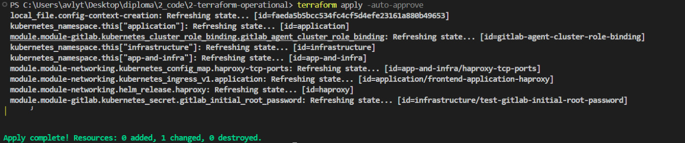
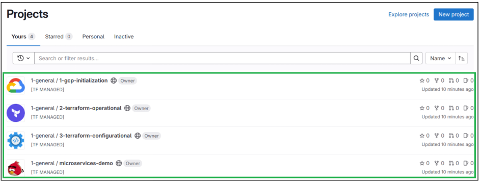

To develop the proposed complex and scalable solution, which includes the use of containerization and orchestration tools with cloud technologies, it is necessary—after deploying the infrastructure—to configure continuous integration and deployment (CI/CD) tools, as well as to organize monitoring using appropriate means.

To minimize additional costs and simplify the development process, it was decided to design a solution that allows development in a local environment and deployment of the finished product to a cloud provider. To implement this approach, the following stages are envisaged:
1. **Stage One** involves deploying a local Kubernetes cluster using virtualization and Docker Desktop. Other infrastructure components will be hosted in this environment, allowing the creation of a fully functional working prototype.
2. **Stage Two** includes configuring CI/CD processes using GitLab and deploying the “Online Boutique” application service to the Kubernetes cluster, which will demonstrate continuous integration and delivery functionality and provide access to the deployed application.
3. **Stage Three** foresees implementing a monitoring system using Grafana, Prometheus, and InfluxDB for collecting, processing, and visualizing system status information.
4. **Stage Four (final)** involves deploying the Kubernetes cluster in the Google Cloud Platform environment, allocating the necessary virtual servers, and migrating the infrastructure components developed in previous stages. This will ensure interaction with the production infrastructure.

The proposed step-by-step approach reduces the overall complexity of the project, optimizes development costs by moving the development environment to local infrastructure, and leverages the benefits of containerization and container orchestration.

# 1. Implementation of Local Infrastructure and Application Deployment

Based on the project infrastructure diagram, all infrastructure components will be located within a Kubernetes cluster, which simplifies local deployment. Instead of a cloud service, Docker Desktop will be used, allowing the deployment of a local Kubernetes cluster on Windows.

## 1.1 Enabling Kubernetes in Docker Desktop

Docker Desktop is a cross-platform software environment that provides users with a convenient graphical interface for working with Docker containers on Windows and macOS operating systems. It integrates key components of the Docker ecosystem, including Docker Engine, Docker CLI, Docker Compose, and Kubernetes, delivering a local development environment that closely resembles production. Thanks to Docker Desktop, developers can easily create, test, and deploy containerized applications, simplifying dependency management and ensuring environment consistency. In addition, the tool supports integration with cloud services and remote container management, making it an important element of modern DevOps infrastructure.

Next, we proceed to initialize an empty Kubernetes cluster using Docker Desktop. Virtualization allows for a unified working environment both in local infrastructure and in the provider’s cloud environment.

**Figure 3.1 – Activating Kubernetes in Docker Desktop.**
* 1 – Navigate to Docker Desktop settings
* 2 – Enable the Kubernetes cluster


**Figure 3.2 – Successful activation of Kubernetes in Docker Desktop.**


## 1.2 Planning the Architecture of Terraform Code

Planning the architecture of Terraform code is a critical stage in developing Infrastructure as Code (IaC), as it ensures scalability, repeatability, and ease of maintenance of infrastructure solutions. The main aspects of this process are modularity, directory structure, state management, and variables. An architectural decision was made to split the Terraform code into several separate independent Git repositories, which simplifies working with a large codebase that can gradually expand in the future:

1. “1-gcp-initialization” — repository responsible for initializing the cloud infrastructure for deploying a Kubernetes cluster and virtual servers;
2. “2-terraform-operational” — repository that provides deployment of infrastructure components in a pre-created Kubernetes cluster, including creating Kubernetes resources for GitLab, Prometheus, Grafana, InfluxDB, and HAProxy;
3. “3-terraform-configurational” — repository for configuring already deployed GitLab and Grafana using Terraform code.

This architectural decision greatly simplifies interaction with infrastructure code and allows it to be clearly structured.

**Figure 3.3 – General structure of Git repositories.**


In addition, this architectural decision establishes a direct dependency between repositories, since, for example, it is impossible to configure the GitLab server without first deploying the corresponding GitLab deployment.

**Figure 3.4 – Direct dependency of Git repositories.**


The next step in simplifying work with Terraform modules was the decision to create a single structure for all future modules. The following file organization template was proposed:

1. “0-main.tf” — file containing the main resources, such as the helm_chart resource;
2. “0-outputs.tf” — contains the module’s output values;
3. “0-providers.tf” — contains a description of the providers used, if they have not previously been declared in the parent modules;
4. “*-values.yaml” — includes configuration values that can be used, for example, in helm_chart resources;
5. “*.tf” — other additional resources.

For standardization purposes, these files form a block conventionally called the “Common Module Pattern,” which facilitates further planning of infrastructure solutions.

**Figure 3.5 – General structure of Terraform modules.**


After making the architectural decision to form the “Common Module Pattern,” the structure of the 2-terraform-operational repository is as follows:

1. “1-module-gitlab” — module responsible for deploying GitLab;
2. “2-module-monitoring” — module responsible for deploying the monitoring system:
   a) “1-module-prometheus” — submodule that deploys Prometheus and Grafana;
   b) “2-module-influxdb” — submodule responsible for deploying InfluxDB;
3. “3-module-networking” — module responsible for deploying HAProxy and configuring network interaction between services, the application, and the load balancer;
4. “4-module-namecheap” — module responsible for configuring the Namecheap DNS server;
5. “etc-cicd” — directory for files required to configure GitLab CI/CD;
6. “TO-EXECUTE” — directory for generated files that simplify interaction with the Kubernetes cluster;
7. “Common Module Pattern (CMP)” — which includes two mutually exclusive parts: “local” and “remote,” which define the interaction environment, i.e., local environment or remote cloud environment.

**Figure 3.6 – General view of the “2-terraform-operational” repository.**


A detailed description of each file of each mentioned module is omitted, as within the context of this documentation it is important to understand the purpose of each module.


## 1.3 Infrastructure Initialization Using Terraform

After organizing the Terraform code for the `2-terraform-operational` repository and implementing it, it became necessary to deploy the infrastructure components.
The first step in local infrastructure deployment is initializing Terraform and the provider modules used. At the time of writing, Terraform version 1.10.5 is used.

**Figure 3.7 – Versions of Terraform and provider modules.**


**Figure 3.8 – File structure of the `2-terraform-operational` repository.**


After verifying the module versions, deployment of infrastructure components to the local Kubernetes cluster can begin. To do this, run the following command in the local terminal:

```bash
terraform apply -auto-approve
```

**Figure 3.9 – Infrastructure deployment results.**


Based on the results, it can be assumed that the components were deployed without errors. A basic check should be performed to verify the state of Kubernetes objects using the command:

```bash
kubectl get po -A
```

**Figure 3.10 – Failed component launches.**


From the command results, we observe that two Kubernetes pods are in an error state. Both errors are expected: the `gitlab-runner` attempts to connect to `gitlab-webservice` but cannot due to incorrect IP resolution via DNS. This is because the domain specified in the configuration has no corresponding DNS server. This issue will be resolved in the next configuration section.

The error for the resource `kube-prometheus-stack-prometheus-node-exporter` is also expected, as the component expects the presence of remote nodes, similar to a cloud provider setup.


## 1.4 Creating DNS Records in CoreDNS and Local Hosts File

Since the local infrastructure does not have a server to resolve IP addresses for DNS names, it is necessary to manually configure the corresponding records. To resolve IP addresses in a browser, add entries to the `hosts` file located at `C:\Windows\System32\drivers\etc\hosts`:

```
127.0.0.1 grafana.ci.alytvynenko.net
127.0.0.1 influxdb.ci.alytvynenko.net
127.0.0.1 gitlab.ci.alytvynenko.net
127.0.0.1 kas.ci.alytvynenko.net
127.0.0.1 minio.ci.alytvynenko.net
127.0.0.1 registry.ci.alytvynenko.net
127.0.0.1 app.ci.alytvynenko.net
```

**Figure 3.11 – Adding local entries.**


After adding the entries, verify their functionality. Since all entries point to the local machine's IP address, any DNS can be used for testing. For example, access GitLab via the configured URL.

**Figure 3.12 – Successful result of editing the `hosts` file.**


From Figure 3.12, it can be concluded that the user has access to all components, as all entries point to the local computer IP.

HAProxy in the Kubernetes cluster acts as a high-performance proxy and load balancer, ensuring efficient distribution of incoming traffic across services or pods, increasing reliability and fault tolerance. Its use in the cluster allows flexible network traffic management, including routing rules, handling connections at L4 (TCP) and L7 (HTTP) layers, and performing health checks to exclude non-functional components from routing.

The next step is configuring DNS in Kubernetes to resolve domain IPs inside the cluster. First, obtain the internal IP of the HAProxy load balancer and use CoreDNS, a Kubernetes component, to configure custom DNS records without deploying additional services. Execute the following commands sequentially:

```bash
kubectl get svc -n app-and-infra
kubectl edit configmap coredns -n kube-system
kubectl get po
```

**Figure 3.13 – Copying the internal IP of the load balancer.**


**Figure 3.14 – Adding custom DNS records to the CoreDNS configuration.**


**Figure 3.15 – GitLab Runner component successfully started.**


After confirming successful initialization of `gitlab-runner`, ensure the component successfully connects to the main server. Authenticate on the main server and verify the presence of `gitlab-runner` via the provided link.

**Figure 3.16 – Authentication on the GitLab web server.**


**Figure 3.17 – `gitlab-runner` successfully connected to the GitLab web server.**


As a result of these steps, the required infrastructure is successfully deployed and ready for use. However, manual verification of each component remains necessary.


## 1.5 Infrastructure Functionality Check

After locally deploying all infrastructure components, a manual verification of each component is necessary to ensure they function correctly.

This section covers only components with DNS names that are accessible to the user via a web browser. A small script was developed to check the service status using `curl`. The following services will be tested:

1. **GitLab** — main domain for GitLab CI/CD and code storage: `gitlab.ci.alytvynenko.net`
2. **GitLab Registry** — internal GitLab service, similar to Docker Hub, deployed locally: `registry.ci.alytvynenko.net`
3. **Grafana** — main domain for accessing the data visualization tool: `grafana.ci.alytvynenko.net`
4. **InfluxDB** — main domain for accessing the metrics database: `influxdb.ci.alytvynenko.net`
5. **Application** — main domain for accessing the user application: `app.ci.alytvynenko.net`

```bash
printf "%-30s | %s\n" "DOMAIN" "RESPONSE_CODE"
for subdomain in gitlab registry grafana influxdb app; do
    fulldomain="$subdomain.ci.alytvynenko.net"
    statuscode=$(curl -sLo /dev/null -w "%{http_code}" $fulldomain)
    printf "%-30s | %s\n" "$fulldomain" "$statuscode"
done
```

**Figure 3.18 – Results of service checks.**


After executing the HTTP requests, the only unexpected response is the unavailability of `app.ci.alytvynenko.net`, which is not yet deployed and requires further configuration. This is expected, as the application still needs to be deployed.


## 1.6 Initializing Infrastructure Configuration with Terraform

All other infrastructure components are available and respond successfully to HTTP requests. The next step is configuring GitLab and Grafana using the `3-terraform-configurational` repository.

For Grafana, a static username and password are used, so no additional intervention is required. GitLab, however, does not support this approach, so it is necessary to log in as the `root` user and create an API token.

**Figure 3.19 – Generating a new token.**


**Figure 3.20 – Copying the newly created token.**


The token must then be added to the `terraform.tfvars` file, which is not tracked by the Git repository. While this approach is not the most secure method for storing credentials, it is the most practical and reasonable solution for this work.

Since IP resolution via DNS and authorization tokens for the respective components are already configured, applying the configuration should proceed without issues.

**Figure 3.21 – Result of infrastructure creation on GitLab and Grafana.**


After applying the configuration using the repository, the GitLab main page shows the created project repositories, and Grafana shows a data source named `influxdb`, confirming the successful execution of the previous steps.

**Figure 3.22 – Project repositories created via Terraform.**


**Figure 3.23 – Data source `influxdb` created.**


Based on these results, it can be concluded that the configuration was successfully applied.


## 1.7 Manual Application Deployment

To deploy the local application, prebuilt containers must be copied from the official repository to the local Docker Registry provided by GitLab. The following script pulls the images, retags them, and pushes them to the local registry:

```bash
export dockerImagesList=(
  "emailservice" "checkoutservice" "recommendationservice"
  "frontend" "paymentservice" "productcatalogservice"
  "cartservice" "loadgenerator" "currencyservice"
  "shippingservice" "adservice"
)

# Pull images
for image in "${dockerImagesList[@]}"; do
  docker pull us-central1-docker.pkg.dev/google-samples/microservices-demo/$image:v0.10.2
done

# Tag images
for image in "${dockerImagesList[@]}"; do
  docker tag us-central1-docker.pkg.dev/google-samples/microservices-demo/$image:v0.10.2 registry.ci.alytvynenko.net/1-general/microservices-demo/$image:v0.10.2
done

# Push images
for image in "${dockerImagesList[@]}"; do
  docker push registry.ci.alytvynenko.net/1-general/microservices-demo/$image:v0.10.2
done
```

After running the script, check the Docker repository in GitLab to confirm that the images have been uploaded.

**Figure 3.24 – Uploaded Docker images in GitLab.**


The presence of images indicates successful copying. Next, Kubernetes resources can be created using manifests referencing these images. Apply the manifests with the following command:

```bash
kubectl apply -f .\kubernetes-manifests.yaml
```

**Figure 3.25 – Result of creating Kubernetes resources.**


To view the created services, run:

```bash
kubectl get po -n application
```

**Figure 3.26 – Status check of newly created Kubernetes resources.**


The status check confirms that the Kubernetes resources have been successfully deployed. This indicates that the application is fully functional and can now be accessed via a web browser.

**Figure 3.27 – Application access check before deployment.**


Based on these steps, it can be concluded that the application has been successfully deployed in the local Kubernetes cluster.


## 1.8 CI/CD Verification

The final stage of deploying the local infrastructure is to verify the operation of GitLab CI/CD and the deployment of the application after changes are made to the source code. For demonstration purposes, the "frontend" component was chosen among all application components, as it allows immediate observation of changes in the application after an update.

To execute this stage, the repository source code must be uploaded to GitLab using either an SSH key or an HTTP token. This step is not detailed here, as it is a basic and obvious task for any DevOps engineer.

**Figure 3.28 – Successful repository upload.**


The pipeline has already started, executing all defined actions. However, since the application was already deployed manually, these actions do not result in any changes for the end user.

**Figure 3.29 – Full view of the working pipeline.**


Creating such a pipeline accelerates development by automating processes. The implemented pipeline consists of seven main stages, executed sequentially. If not specified otherwise, the pipeline always runs. Each stage is described in detail below:

- **0-start-measure** – Records the start time of the pipeline for later calculation of total execution time.
- **1-lint** – Runs linters to analyze code style and provide improvement recommendations:
  1. **1-terraform-lint** – For Terraform files
  2. **2-helm-lint** – For Helm files
  3. **3-kustomize-lint** – For Kustomize files
- **2-build** – Responsible for building components:
  1. **2-helm-build** – Builds Helm files
  2. **3-kustomize-build** – Builds Kustomize files
  3. **4-docker-build** – Builds and pushes the Docker image for the "frontend" component
- **3-test** – Responsible for testing:
  1. **3-kustomize-test** – Tests the assembled Kustomize files
- **4-deploy** – Deploys successfully built artifacts; in this case, the frontend Docker container:
  1. **deploy** – Deploys the Docker image of the "frontend" component to the Kubernetes cluster
- **5-emergency-only** – Never runs automatically; only used for emergencies:
  1. **destroy** – Destroys all application resources in the Kubernetes cluster
- **0-end-measure** – Calculates the total pipeline execution time, determines its status, and sends data to InfluxDB:
  1. **on_failure** – Sends execution time and failure status to InfluxDB
  2. **on_success** – Sends execution time and success status to InfluxDB

After understanding each stage of the pipeline, text changes can be made on the main page to test the pipeline. First, the current appearance of the application is recorded before any changes.

**Figure 3.30 – Initial view of the application.**


Once the initial view is recorded, a text change can be made to the main heading on the page. This change automatically triggers the pipeline and executes all programmed steps.

**Figure 3.31 – Changing the main page heading.**


According to the pipeline results, all stages completed successfully, and the changes can now be verified.

**Figure 3.32 – Pipeline execution result.**


The results show that everything ran successfully with no issues. The updated application page can now be checked.

**Figure 3.33 – Updated application web page**


From the screenshot, the heading changed from "Hot Products" to "SUPER VERY Hot Products," confirming that the CI/CD process works correctly.


## 1.9 Data Viewing and Visualization

Data viewing and visualization using InfluxDB and Grafana involves collecting, storing, and graphically representing time series data, enabling efficient analysis of dynamic processes in real time. InfluxDB acts as a high-performance database optimized for storing large volumes of time series data from GitLab pipelines. Grafana provides flexible tools for creating interactive monitoring dashboards, allowing users to visualize data, set thresholds, build charts, and identify anomalies or patterns. Using these technologies together enhances understanding of system metrics and supports informed decision-making based on up-to-date information.

As noted previously, the CI/CD pipeline includes the "0-start-measure" and "0-end-measure" stages, which collect pipeline performance data and send it to InfluxDB, where Grafana later uses it for visualization.

Access the InfluxDB web interface and log in with static credentials: login `admin` and password `admin-initial-password`.

**Steps:**
1. Use the DNS name of InfluxDB.
2. Enter login credentials.

**Figure 3.34 – InfluxDB web interface login.**


Next, go to the **Data Explorer** section to view existing data. The Data Explorer in InfluxDB is an interactive tool embedded in the web interface for exploring, analyzing, and pre-visualizing stored time series data. It allows queries using Flux or SQL and displays results as tables or charts.

**Query elements:**
1. Measurement type
2. Measurement fields
3. Additional repository filter
4. Output of all measurement field data
5. List of retrieved data for each field

**Figure 3.35 – Query result in InfluxDB.**


In addition to main pipeline runs, test runs were executed to generate records in InfluxDB. With the preconfigured structure, data can be filtered by metric type and pipeline name (shown in columns 2 and 3 in Figure 3.35). Filter data by pipeline execution duration.

**Steps:**
1. Create a query to retrieve pipeline execution duration
2. Query result

**Figure 3.36 – Query result for pipeline execution time.**


The data is available and can be used for further visualization.

The next step is visualizing data with Grafana. Open the Grafana web page and log in using static credentials: login `admin` and password `admin`.

**Steps:**
1. Use the DNS name of Grafana
2. Enter login credentials

**Figure 3.37 – Grafana web interface login.**


Using the configuration from the `3-terraform-configurational` repository, dashboards for viewing data were automatically created.

**Steps:**
1. Select the **Dashboards** tab
2. Select the **Application Pipeline Monitoring** dashboard

**Figure 3.38 – Pipeline monitoring dashboard view.**


The **Application Pipeline Monitoring** dashboard visualizes GitLab pipeline data, including status and execution time, enabling real-time monitoring and analysis of CI/CD lifecycle stages. It allows identification of errors, delays, inefficiencies, and assessment of overall deployment performance. Visualization tools integrated with GitLab or external solutions (Grafana with Prometheus) build charts and dashboards showing metrics like execution duration, run frequency, and pipeline success/failure rates, supporting data-driven decisions to optimize development processes and maintain software stability.

Select the **Application Pipeline Monitoring** dashboard to view charts.

**Charts:**
1. Pipeline status chart
2. Pipeline execution time chart

**Figure 3.39 – Pipeline monitoring dashboard view.**


This confirms that visualization of pipeline-collected data works as expected.

Since Grafana is deployed as part of the **kube-prometheus-stack**, Kubernetes component monitoring and visualization are also configured. All dashboards from this stack are available in the dashboard list.

The **kube-prometheus-stack** is a comprehensive Kubernetes monitoring toolkit based on Prometheus for metrics collection and Grafana for visualization, with components for service discovery, log collection, and alerting. It provides an integrated infrastructure for collecting, storing, and analyzing cluster telemetry, including node, pod, network, and application metrics. It also includes Alertmanager for critical alerts and kube-state-metrics for exporting internal Kubernetes object states compatible with Prometheus.

**Figure 3.40 – List of kube-prometheus-stack dashboards.**


To verify proper dashboard functionality with Prometheus as a data source, open the **Kubernetes / API Server** dashboard, which uses Prometheus metrics collected from the cluster.

**Figure 3.41 – Kubernetes / API Server dashboard from kube-prometheus-stack.**


The data is displayed correctly, confirming successful data collection via Prometheus and its availability in Grafana for visualization.
