# TESTING AND VERIFICATION

## 1. Infrastructure Functions to Test

To assess the reliability and performance of the deployed DevOps infrastructure, comprehensive testing of its core functional components is required. This includes verifying operation under both standard conditions and abnormal or failure scenarios.

First, the behavior of GitLab CI should be checked when erroneous changes are introduced to the code. The CI process must not only stop the pipeline execution but also provide detailed information for analyzing the cause of the failure. Additionally, the full CI/CD cycle is tested under a correct scenario: the code must pass through all stages — linting, building, testing, Docker image creation, and deployment in Kubernetes — without interruptions in application operation.

## 2. Infrastructure Verification

Verification is a process in software development that confirms the system is built according to established requirements and specifications. Unlike validation, which determines whether the system meets user needs, verification focuses on technical compliance. It involves systematic analysis of artifacts to identify deviations from project documentation and implementation errors.

Special attention is given to the sequence and consistency of processes, particularly verifying the continuity of the CI/CD process from GitLab commits to build, test, and deployment stages in the Kubernetes environment.

The summarized verification results are presented in Table 4.1.

**Table 4.1 – Verification Results**

| №  | Name                                                                 | Requirement                                                                                               | Result                                                                                 |
|----|----------------------------------------------------------------------|-----------------------------------------------------------------------------------------------------------|---------------------------------------------------------------------------------------|
| **Local Environment** | | | |
| 1  | Deployment of infrastructure within the local Kubernetes cluster     | Deployed GitLab, Grafana, InfluxDB, Prometheus, and HAProxy using the repository **“2-terraform-operational”** via Terraform code | Local infrastructure successfully deployed; each component is accessible             |
| 2  | Automatic configuration within the local Kubernetes cluster          | Configured GitLab and Grafana using the repository **“3-terraform-configurational”** via Terraform code | Local infrastructure successfully configured                                         |
| **Cloud Environment** | | | |
| 3  | Cloud infrastructure deployment                                      | Deployed cloud infrastructure using the repository **“1-gcp-initialization”** via Terraform code         | Cloud infrastructure successfully deployed                                           |
| 4  | Deployment of infrastructure within the cloud Kubernetes cluster    | Deployed GitLab, Grafana, InfluxDB, Prometheus, and HAProxy using the repository **“2-terraform-operational”** via Terraform code | Cloud infrastructure successfully deployed; each component accessible via public domains |
| 5  | Automatic configuration within the cloud Kubernetes cluster         | Configured GitLab and Grafana using the repository **“3-terraform-configurational”** via Terraform code | Local infrastructure successfully configured                                         |
| **Components within Kubernetes** | | | |
| 6  | Connecting GitLab Runner to the main GitLab server                   | GitLab Runner connected to the main GitLab server without errors                                         | GitLab Runner successfully connected                                                 |
| 7  | Connecting InfluxDB to Grafana                                       | InfluxDB connected to Grafana in the **“Data sources”** section                                           | InfluxDB successfully connected to Grafana                                           |

## 3. Testing the CI/CD Pipeline

Software testing is a critical stage in development, as it ensures the correctness and stability of the software. This process typically involves executing a set of tests, which are instructions for verifying specific functionality. To create a test suite, tests must be prepared and developed so that their analysis provides a clear assessment of the software's functionality. Additionally, the testing process should be documented through reports, facilitating future analysis.

It is important to note that in modern software development, special attention is given to testing because, in large teams, it is difficult to anticipate all possible scenarios during code writing. This challenge also affects DevOps engineers, making pipeline testing crucial before deployment. Improper pipeline behavior can disrupt the software delivery chain, potentially causing financial losses. Ensuring pipeline stability through thorough testing is therefore essential in any DevOps project.

The CI/CD pipeline testing is described in Tables 4.2–4.4:

**Table 4.2 – Test Case: Terraform Linter Functionality Check**

| Verification Name | Terraform Linter Functionality Check |
|------------------|-------------------------------------|
| Environment & Versions | Windows 11 Home - Version 10.0.22000 Build 22000 (64-bit), Chrome - 136.0.7103.114 (64-bit) |
| Pre-step Actions | CI/CD configured in the GitLab project |

| Steps | Expected Results |
|-------|-----------------|
| 1. Create a separate branch **test/tf-linter** in the GitLab project **microservices-demo** | 1. Separate branch **test/tf-linter** created in **microservices-demo** |
| 2. Introduce a change in the branch that breaks Terraform syntax | 2. Change violating Terraform syntax is created |
| 3. Review the last executed pipeline | 3. Failing stage **1-terraform-lint** |

**Attachments:**

**Figure 4.1 – Created separate branch `test/tf-linter` in the project `microservices-demo`**
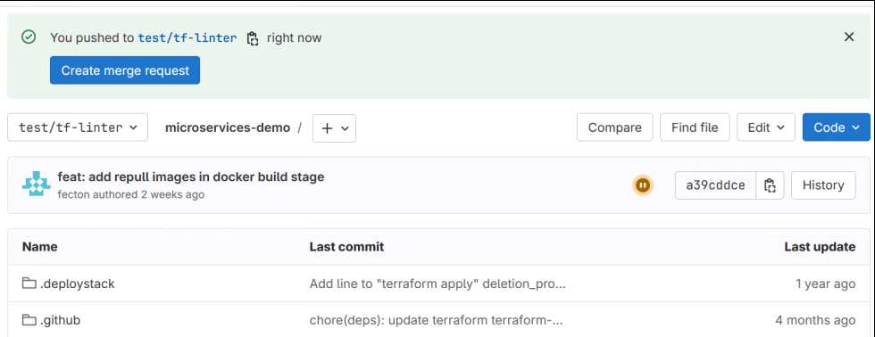

**Figure 4.2 – Change introduced that breaks Terraform syntax**
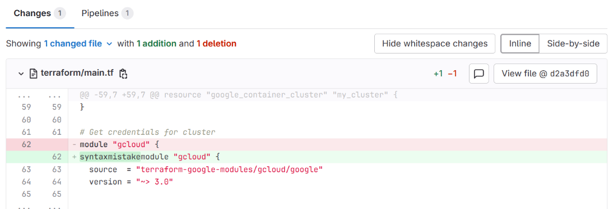

**Figure 4.3 – Failing stage `1-terraform-lint`**
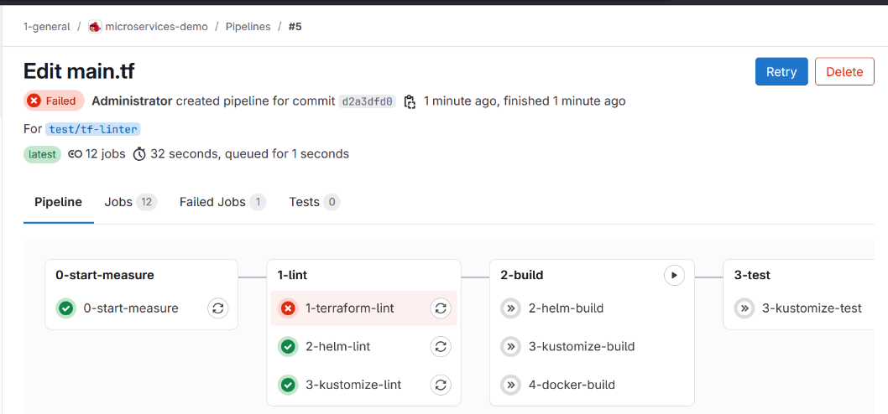

**Figure 4.4 – Details of the failing stage `1-terraform-lint`**
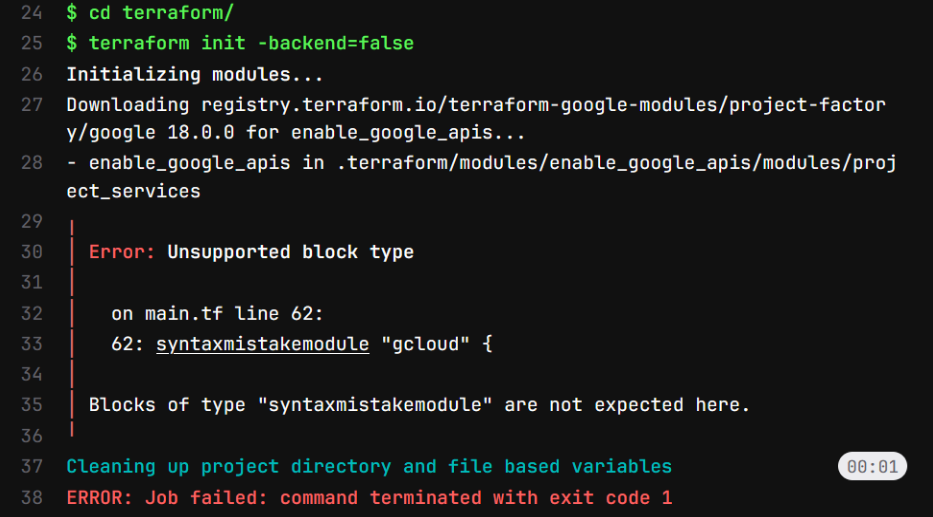

---

**Table 4.3 – Test Case: Docker Build Functionality Check**

| Verification Name | Docker Build Functionality Check |
|------------------|---------------------------------|
| Environment & Versions | Windows 11 Home - Version 10.0.22000 Build 22000 (64-bit), Chrome - 136.0.7103.114 (64-bit) |
| Pre-step Actions | CI/CD configured in the GitLab project |

| Steps | Expected Results |
|-------|-----------------|
| 1. Create a separate branch **test/build-docker** in the GitLab project **microservices-demo** | 1. Separate branch **test/build-docker** created in **microservices-demo** |
| 2. Introduce a change in the branch that breaks Docker syntax | 2. Change violating Docker syntax is created |
| 3. Review the last executed pipeline | 3. Failing stage **4-docker-build** |

**Attachments:**

**Figure 4.5 – Created separate branch `test/build-docker` in the project `microservices-demo`**
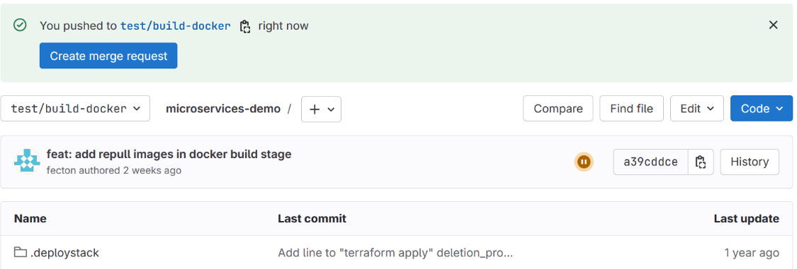

**Figure 4.6 – Change introduced that breaks Docker syntax**
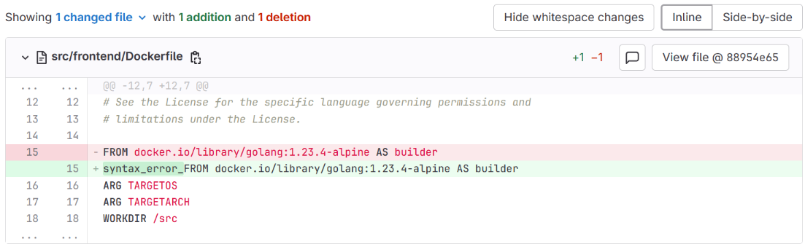

**Figure 4.7 – Failing stage `4-docker-build`**
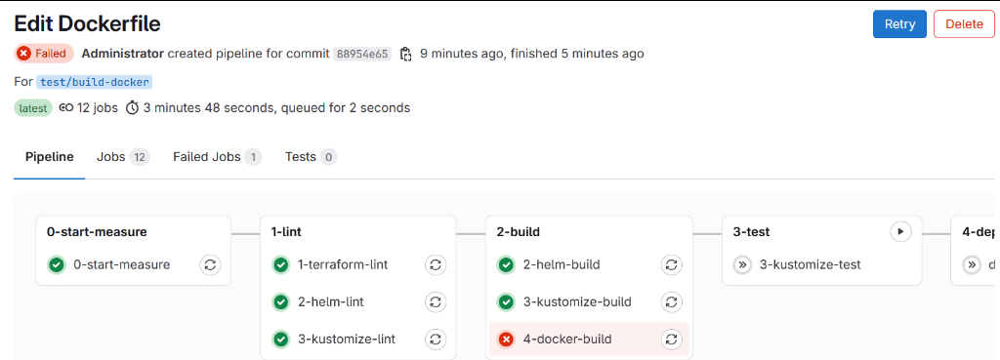

**Figure 4.8 – Details of the failing stage `4-docker-build`**
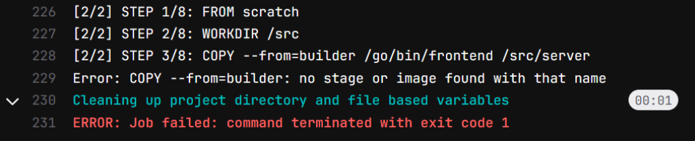

---

**Table 4.4 – Test Case: Data Sending to InfluxDB Functionality Check**

| Verification Name | Data Sending to InfluxDB Functionality Check |
|------------------|---------------------------------------------|
| Environment & Versions | Windows 11 Home - Version 10.0.22000 Build 22000 (64-bit), Chrome - 136.0.7103.114 (64-bit) |
| Pre-step Actions | CI/CD configured in the GitLab project |

| Steps | Expected Results |
|-------|-----------------|
| 1. Run the pipeline for the stable version in the GitLab project **microservices-demo** and review the **0-end-measure** stage | 1. Successful pipeline with successful **on_success** step of the **0-end-measure** stage |
| 2. Create a separate branch **test/influx-fail** | 2. Separate branch **test/influx-fail** created in **microservices-demo** |
| 3. Introduce a change that breaks Docker syntax | 3. Change violating Docker syntax is created |
| 4. Review the **0-end-measure** stage in the last executed pipeline of the branch **test/influx-fail** | 4. Failing pipeline with **on_failure** step of the **0-end-measure** stage |

**Attachments:**

**Figure 4.9 – Successful pipeline with successful `on_success` step of the `0-end-measure` stage**
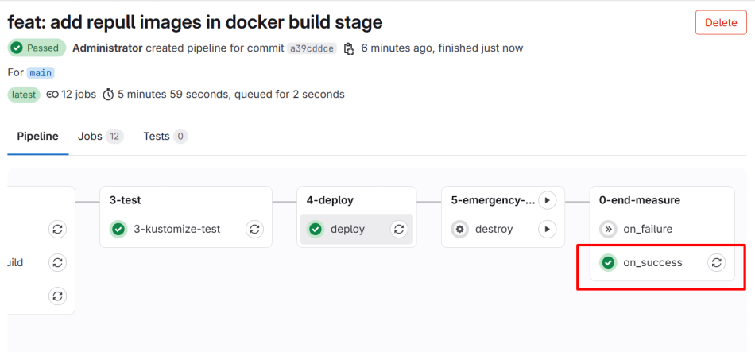

**Figure 4.10 – Created separate branch `test/influx-fail` in the project `microservices-demo`**
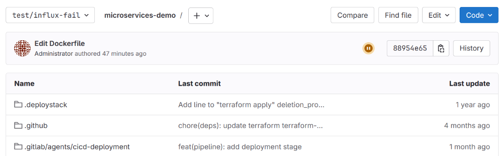

**Figure 4.11 – Change introduced that breaks Docker syntax**
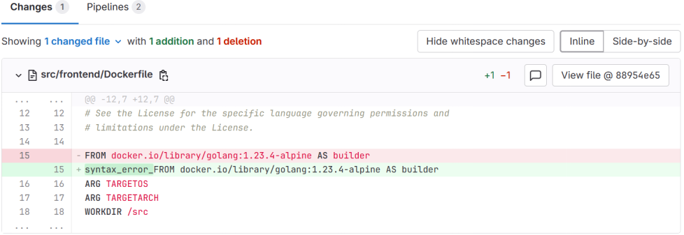

**Figure 4.12 – Failing pipeline with `on_failure` step of the `0-end-measure` stage**
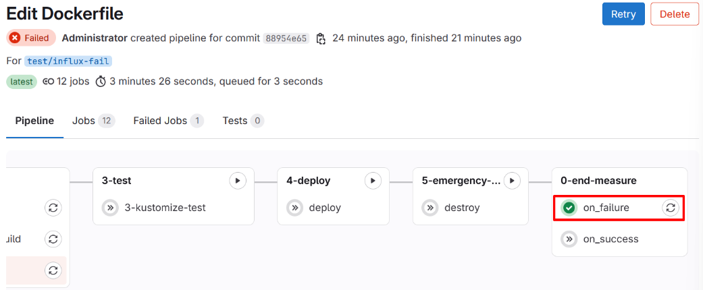

**Figure 4.13 – Visualization of recorded data in Grafana using InfluxDB as the data source**
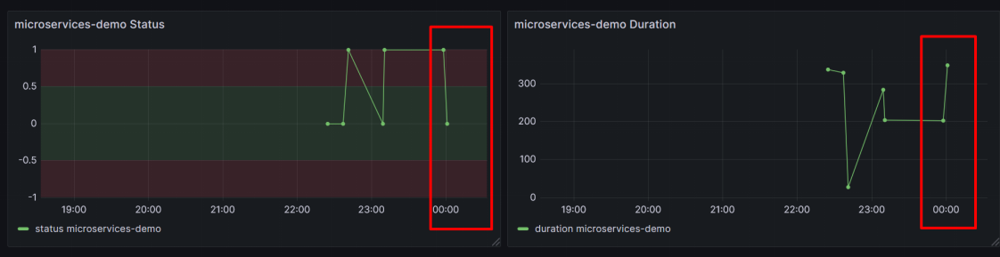

---

## Conclusions of the Section

After testing the CI/CD infrastructure, the functionality of the main pipeline stages was successfully verified, confirming the operational correctness of the pipeline. The verification process also confirmed the successful deployment of the infrastructure both locally and in the cloud environment, including the creation and configuration of internal components. This makes the solution resilient to various scenarios and capable of reliably performing continuous integration and deployment tasks.
