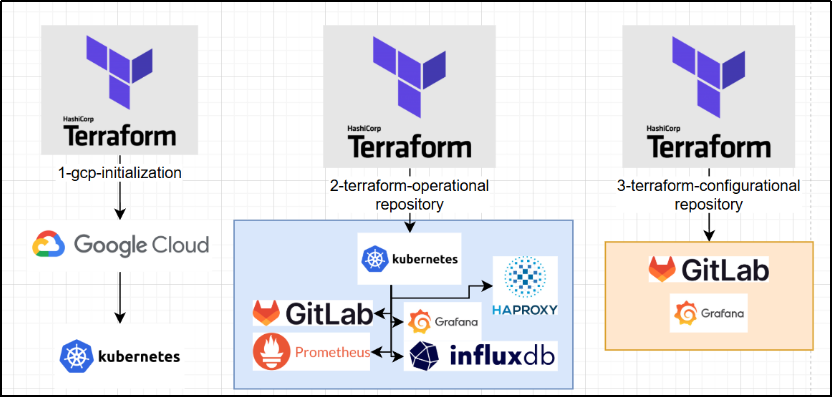
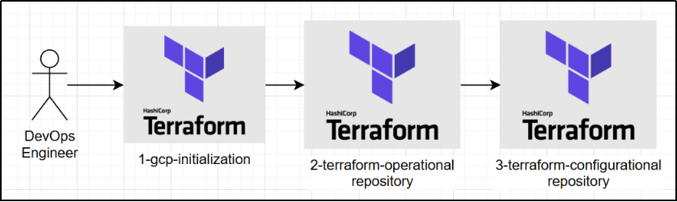

# Summary
This project was created to demonstrate my professional skills in architecture design, coding, implementing CI/CD practices, and deploying and managing infrastructure.

The project code can be used for personal, commercial, and educational purposes without requiring permission.

Please note that the developer is not responsible for keeping the repositories and documentation up to date with the latest industry standards. Additionally, the developer is not responsible for fixing bugs that may arise during usage or providing support for their resolution. Consider this when deciding on its use.

* Object of research – infrastructure for a web application.
* The aim of the thesis is to implement tools for continuous integration, delivery, deployment, and monitoring of a containerized web application. The main focus is on building an efficient, scalable, and manageable infrastructure using modern cloud technologies and the “Infrastructure as Code” approach.
* The qualification work examines various infrastructure types: local (based on Docker Desktop), cloud-based (using Google Cloud Platform), and orchestrated environments (based on Kubernetes). Their advantages and disadvantages are compared. An automated deployment system was implemented using GitLab CI/CD. Monitoring was configured with Grafana, Prometheus, and InfluxDB. The microservices-based “Online Boutique” application was deployed as a case study.
* The results of this thesis can be applied to implementing DevOps practices in IT companies, automating various types of infrastructures, and deploying other containerized applications in cloud environments.

# List of Repositories
* [0-documentation](https://github.com/devops-skill-demonstration/0-documentation) - the repository consists all documentation that is related to the project, not to the specific repository
* [1-gcp-initialization](https://github.com/devops-skill-demonstration/1-gcp-initialization) - the repository consists Terraform code for deploying GCP components that is the preparation for the next repository
* [2-terraform-operational](https://github.com/devops-skill-demonstration/2-terraform-operational) - the repository consists Terraform code for deploying components inside GCP resources like Kubernetes Pods, Ingress configurations etc.
* [3-terraform-configurational](https://github.com/devops-skill-demonstration/3-terraform-configurational)- the repository consists Terraform code for deploying configuration of the deployed components in the previous repository
* [microservices-demo](https://github.com/devops-skill-demonstration/microservices-demo) - the repository is a fork of the Google's repository that represents ready-to-deploy application for Kubernetes and GCP environment

Direct dependency between repositories:

# Stack of Technologies

* InfluxDB
* HAProxy

# List of Conventional Signs, Symbols, Units, Abbreviations, and Terms.
* API – Application Programming Interface
* AWS – Amazon Web Services
* CI/CD – Continuous Integration / Continuous Deployment
* CSM – Customer Success Manager
* DNS – Domain Name System
* DevOps – Development + Operations
* GCP – Google Cloud Platform
* GKE – Google Kubernetes Engine
* HTTP – HyperText Transfer Protocol
* IP – з англ. Internet Protocol
* IaC – Infrastructure as Code
* KAS – Kubernetes Agent Server
* SSH – Secure Shell
* URL – Uniform Resource Locator

> The documentation below is an AI translation of my diploma, original written in Ukrainian.

> The AI translation was done using ChatGPT-5

# 1. Analysis of the Subject Area and Problem Statement.
## > [CLICK-TO-OPEN](./1-analysis-of-the-subject.md)

# 2. Analysis and Selection of Infrastructure Development Tools
## > [CLICK-TO-OPEN](./2-analysis-of-dev-tools.md)

# 3. Development of the Project Solution
## > [CLICK-TO-OPEN](./3-development-of-the-project.md)

